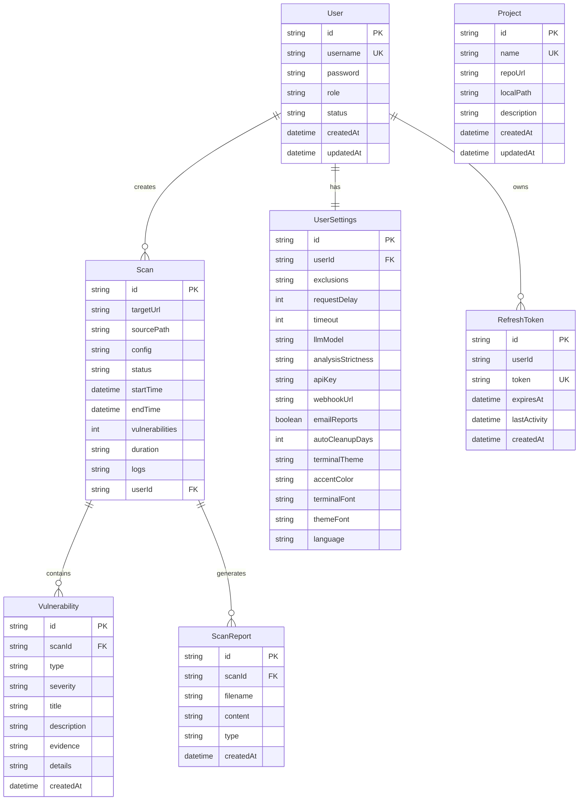

<div align="center">

# 🚪 DokodemoDoor

### **AI 기반 자율 보안 테스팅 플랫폼**

*"어디든지 문" - 포괄적인 보안 분석을 위한 관문*

[](https://nextjs.org/)
[](https://www.typescriptlang.org/)
[](https://www.prisma.io/)
[](https://reactjs.org/)
[](LICENSE)

---

**[기능](#-핵심-기능)** •
**[아키텍처](#-아키텍처)** •
**[설치](#-설치)** •
**[사용법](#-사용법)** •
**[기술 스택](#-기술-스택)** •
**[보안](#-보안-기능)**

</div>

---

## 🌟 개요

**DokodemoDoor**는 취약점 평가 및 모의해킹 워크플로우를 혁신하는 차세대 AI 기반 자율 보안 테스팅 플랫폼입니다. 일본어 "どこでもドア"(어디든지 문)에서 이름을 따온 이 플랫폼은 웹 애플리케이션과 소스 코드 저장소 전반에 걸쳐 포괄적인 보안 분석에 대한 원활한 접근을 제공합니다.

### 🎯 미션

최첨단 AI 에이전트, 실시간 모니터링, 엔터프라이즈급 보고를 하나의 직관적인 플랫폼으로 결합하여 온라인 및 폐쇄망 환경 모두에서 원활하게 작동하는 고급 보안 테스팅을 대중화합니다.

---

## ✨ 핵심 기능

### 🤖 **자율 AI 기반 보안 스캐닝**

DokodemoDoor는 고급 AI 에이전트를 활용하여 최소한의 인간 개입으로 포괄적인 보안 평가를 수행합니다:

- **다단계 에이전트 오케스트레이션**: 전문화된 보안 에이전트의 조율된 실행
- **지능형 취약점 탐지**: 시그니처 기반 탐지를 넘어서는 AI 기반 분석
- **적응형 테스팅 전략**: 대상 특성에 따라 동적으로 접근 방식을 조정하는 에이전트
- **자동 보고서 생성**: 실행 가능한 인사이트가 포함된 전문가급 보안 보고서
- **한국어 번역 지원**: 현지화된 규정 준수 요구사항을 위한 자동 보고서 번역


### 📊 **실시간 터미널 모니터링**

보안 테스팅 작업에 대한 전례 없는 가시성을 경험하세요:

- **라이브 XTerm.js 통합**: 브라우저 내 완전한 기능의 터미널 에뮬레이션
- **WebSocket 기반 스트리밍**: 지연 시간 제로의 실시간 로그 출력
- **다중 테마 지원**:
  - 🌞 **Bright** - 주간 작업을 위한 고대비 라이트 테마
  - 📜 **Beige** - 따뜻한 향수를 불러일으키는 종이 스타일 테마
  - 💚 **Matrix** - 클래식 녹색-검정 해커 미학
- **커스텀 폰트 선택**: JetBrains Mono, Fira Code 및 시스템 모노스페이스 폰트
- **영구 로그 저장**: 데이터베이스에 저장된 완전한 터미널 히스토리
- **내보내기 기능**: 오프라인 분석 및 아카이빙을 위한 로그 다운로드

### 🎨 **프리미엄 UI/UX 디자인**

미학과 기능성을 결합한 시각적으로 놀라운 인터페이스:

- **글래스모피즘 효과**: 백드롭 블러가 적용된 현대적인 반투명 유리 UI 컴포넌트
- **동적 오로라 배경**: 테마 색상에 적응하는 애니메이션 그라디언트 배경
- **부드러운 마이크로 애니메이션**: Framer Motion 기반 전환 및 인터랙션
- **반응형 디자인**: 데스크톱, 태블릿, 모바일 기기에서 완벽한 경험
- **다크 모드 최적화**: 장시간 사용을 위한 눈에 편안한 색상 구성
- **커스터마이징 가능한 강조 색상**: 선호도에 맞게 인터페이스 개인화


### 🔒 **엔터프라이즈 보안 관리**

엔터프라이즈 요구사항을 염두에 두고 구축:

- **역할 기반 접근 제어(RBAC)**:
  - 👑 **ADMIN** - 전체 시스템 접근 및 사용자 관리
  - 🛡️ **SECURITY** - 보안 테스팅 및 보고서 접근
  - 👤 **USER** - 제한된 읽기 전용 접근
- **JWT 인증**: 리프레시 토큰이 포함된 안전한 토큰 기반 인증
- **세션 관리**: 자동 토큰 갱신 및 활동 추적
- **비밀번호 암호화**: 솔트 라운드가 적용된 bcrypt 기반 비밀번호 해싱
- **감사 로깅**: 규정 준수를 위한 포괄적인 활동 추적
- **데이터 격리**: 사용자 범위 데이터 접근 및 멀티 테넌시 지원

### 📁 **포괄적인 프로젝트 관리**

보안 평가를 효율적으로 구성하고 추적:

- **Git 저장소 통합**: 원격 저장소 복제 및 분석
- **로컬 프로젝트 지원**: 로컬 코드베이스 및 파일 시스템 스캔
- **프로젝트 프로필**: 프로젝트 메타데이터, 설명 및 구성 저장
- **스캔 히스토리 추적**: 모든 보안 평가의 완전한 감사 추적
- **수동 보고서 등록**: 외부 모의해킹 결과 가져오기
- **대량 작업**: 배치 스캐닝 및 보고서 생성

### 📈 **고급 보고 및 분석**

원시 보안 데이터를 실행 가능한 인텔리전스로 변환:

- **다중 형식 보고서**:
  - 📄 구문 강조가 적용된 Markdown 보고서
  - 📊 JSON 구조화된 데이터 내보내기
  - 📝 일반 텍스트 요약
- **심각도 분류**: CRITICAL, HIGH, MEDIUM, LOW, INFO
- **증거 보존**: 코드 스니펫, URL 및 개념 증명 데이터
- **취약점 집계**: 발생 추적이 포함된 중복 제거된 발견사항
- **추세 분석**: 스캔 전반에 걸친 히스토리컬 취약점 추적
- **아카이브 뷰어**: 구문 강조가 적용된 대화형 보고서 브라우저

### 🌐 **폐쇄망 배포 준비**

안전한 격리 네트워크 환경을 위해 설계:

- **독립 실행형 빌드 모드**: 자체 포함된 Next.js 독립 실행형 출력
- **외부 종속성 없음**: 모든 폰트 및 자산이 로컬로 번들링됨
- **SQLite 데이터베이스**: 외부 서비스가 필요 없는 임베디드 데이터베이스
- **오프라인 작동**: 인터넷 연결 없이 전체 기능 제공
- **마이그레이션 스크립트**: 폐쇄망 전송을 위한 자동화된 패키징
- **문서화된 배포**: 포함된 포괄적인 마이그레이션 가이드

---

## 🏗️ 아키텍처

### 시스템 아키텍처


### 데이터베이스 스키마



### 에이전트 워크플로우


---

## 🚀 설치

### 사전 요구사항

- **Node.js**: v20.0.0 이상
- **npm**: v10.0.0 이상
- **Git**: 저장소 복제용
- **SQLite**: 임베디드 (별도 설치 불필요)

### 빠른 시작

```bash
# 저장소 복제
git clone https://github.com/airsalso/dokodemodoor-front.git
cd dokodemodoor-front

# 의존성 설치
npm install

# Prisma 클라이언트 생성
npx prisma generate

# 데이터베이스 마이그레이션 실행
npx prisma migrate deploy

# 초기 데이터 시드 (선택사항)
node prisma/seed.js

# 개발 서버 시작
npm run dev
```

애플리케이션은 `http://localhost:3000`에서 사용 가능합니다

### 환경 설정

루트 디렉토리에 `.env` 파일 생성:

```env
# 데이터베이스
DATABASE_URL="file:./prisma/dev.db"

# 인증
JWT_SECRET="프로덕션에서-변경해야-하는-매우-안전한-jwt-키"
JWT_EXPIRES_IN="15m"
REFRESH_TOKEN_EXPIRES_IN="7d"

# AI 설정 (선택사항)
OPENAI_API_KEY="sk-..."
ANTHROPIC_API_KEY="sk-ant-..."

# 애플리케이션
NEXT_PUBLIC_API_URL="http://localhost:3000"
NODE_ENV="development"
```

### 프로덕션 빌드

```bash
# 프로덕션용 빌드
npm run build

# 프로덕션 서버 시작
npm run start
```

### 폐쇄망 배포

안전한 격리 네트워크 환경의 경우 포괄적인 마이그레이션 가이드를 따르세요:

```bash
# 독립 실행형 패키지 빌드
npm run build

# 마이그레이션용 패키징
./migration.sh

# dokodemodoor_migration_v1.tar.gz를 대상 환경으로 전송
# 폐쇄망 서버에서 압축 해제 및 실행
```

자세한 지침은 [MIGRATION.md](file:///home/ubuntu/dokodemodoor-front/MIGRATION.md)를 참조하세요.

---

## 💻 사용법

### 첫 번째 스캔 생성

1. 자격 증명으로 플랫폼에 **로그인**
2. **스캔** → **새 스캔**으로 이동
3. 스캔 유형 선택:
   - 🌐 **웹 애플리케이션** - 대상 URL 입력
   - 📁 **소스 코드** - 저장소에서 프로젝트 선택
4. 스캔 매개변수 구성 (선택사항)
5. **스캔 시작**을 클릭하고 실시간 진행 상황 모니터링
6. **스캔 세부정보** 페이지에서 결과 검토

### 프로젝트 관리

```bash
# 프로젝트는 UI를 통해 관리됩니다
# 프로젝트 → 새 프로젝트 추가로 이동

# Git 저장소의 경우:
- 저장소 URL 입력
- 필요한 경우 인증 제공
- 시스템이 자동으로 복제

# 로컬 프로젝트의 경우:
- 로컬 파일 경로 지정
- 프로젝트 설명 추가
- 스캔 제외 항목 구성
```

### 보고서 보기

- **스캔 히스토리**: 상태 표시기가 있는 모든 완료된 스캔 보기
- **보고서 아카이브**: 유형별로 생성된 보고서 탐색 (MD, JSON, TXT)
- **취약점 대시보드**: 모든 발견사항의 집계 보기
- **내보내기 옵션**: 오프라인 분석을 위한 보고서 다운로드

### 사용자 관리 (관리자 전용)

- **사용자 생성**: 역할 할당과 함께 새 팀 멤버 추가
- **권한 관리**: 사용자 역할 및 접근 수준 조정
- **감사 로그**: 사용자 활동 및 시스템 이벤트 검토
- **데이터 정리**: 자동 데이터 보존 정책 구성

---

## 🛠️ 기술 스택

### 프론트엔드

| 기술 | 버전 | 목적 |
|------|------|------|
| **Next.js** | 16.1.2 | App Router가 포함된 React 프레임워크 |
| **React** | 19.2.3 | UI 컴포넌트 라이브러리 |
| **TypeScript** | 5.x | 타입 안전 개발 |
| **Tailwind CSS** | 4.x | 유틸리티 우선 CSS 프레임워크 |
| **Framer Motion** | 12.26.2 | 애니메이션 라이브러리 |
| **XTerm.js** | 6.0.0 | 터미널 에뮬레이션 |
| **Lucide React** | 0.562.0 | 아이콘 라이브러리 |
| **React Markdown** | 10.1.0 | Markdown 렌더링 |
| **React Syntax Highlighter** | 16.1.0 | 코드 구문 강조 |

### 백엔드

| 기술 | 버전 | 목적 |
|------|------|------|
| **Prisma** | 6.2.1 | ORM 및 데이터베이스 툴킷 |
| **SQLite** | 3.x | 임베디드 데이터베이스 |
| **Socket.io** | 4.8.3 | 실시간 WebSocket 통신 |
| **Jose** | 6.1.3 | JWT 인증 |
| **bcryptjs** | 3.0.3 | 비밀번호 해싱 |
| **date-fns** | 4.1.0 | 날짜 조작 |

### 개발 도구

- **ESLint**: Next.js 구성이 포함된 코드 린팅
- **PostCSS**: CSS 처리
- **TypeScript**: 정적 타입 검사
- **Prisma Studio**: 데이터베이스 GUI

---

## 🔐 보안 기능

### 인증 및 권한 부여

- **JWT 기반 인증**: 상태 비저장 토큰 기반 인증
- **리프레시 토큰 로테이션**: 보안이 적용된 자동 토큰 갱신
- **비밀번호 해싱**: 구성 가능한 솔트 라운드가 적용된 bcrypt
- **역할 기반 접근 제어**: 세분화된 권한 시스템
- **세션 관리**: 활동 추적 및 타임아웃 처리

### 데이터 보호

- **SQL 인젝션 방지**: Prisma ORM 매개변수화된 쿼리
- **XSS 보호**: React의 내장 이스케이핑
- **CSRF 보호**: 토큰 기반 요청 검증
- **보안 헤더**: 구성된 Next.js 보안 헤더
- **입력 검증**: 모든 입력에 대한 서버 측 검증

### 취약점 탐지

DokodemoDoor가 식별할 수 있는 취약점:

- 🔓 **SQL 인젝션** - 데이터베이스 쿼리 조작
- 🌐 **크로스 사이트 스크립팅(XSS)** - 클라이언트 측 코드 인젝션
- 🔑 **인증 우회** - 취약한 인증 메커니즘
- 📂 **경로 순회** - 디렉토리 순회 취약점
- 🔐 **안전하지 않은 역직렬화** - 객체 인젝션 공격
- ⚙️ **서버 측 요청 위조(SSRF)** - 내부 네트워크 접근
- 📝 **정보 노출** - 민감한 데이터 노출
- 🔧 **보안 설정 오류** - 부적절한 설정
- 🆔 **손상된 접근 제어** - 무단 접근
- 🐛 **코드 품질 문제** - 보안 안티패턴

---

## 📊 성능 및 확장성

### 최적화 기능

- **Next.js 독립 실행형 모드**: 최소한의 프로덕션 풋프린트
- **정적 자산 최적화**: 자동 이미지 및 폰트 최적화
- **코드 분할**: 더 빠른 페이지 로드를 위한 동적 임포트
- **지연 로딩**: 필요에 따라 로드되는 컴포넌트
- **데이터베이스 인덱싱**: Prisma 인덱스로 최적화된 쿼리
- **WebSocket 효율성**: 로그 스트리밍을 위한 바이너리 프로토콜

### 확장성 고려사항

- **수평 확장**: 상태 비저장 아키텍처가 로드 밸런싱 지원
- **데이터베이스 샤딩**: SQLite를 PostgreSQL/MySQL로 교체 가능
- **캐싱 전략**: 자주 액세스하는 데이터를 위한 인메모리 캐싱
- **백그라운드 작업**: 장기 실행 스캔을 위한 비동기 처리
- **리소스 제한**: 구성 가능한 타임아웃 및 동시성 제한

---

## 🎨 커스터마이징

### 테마 커스터마이징

테마를 커스터마이징하려면 `src/app/globals.css`를 수정하세요:

```css
:root {
  --primary: #8b5cf6;        /* 기본 강조 색상 */
  --primary-rgb: 139, 92, 246; /* 투명도를 위한 RGB 값 */
  --accent: #3b82f6;         /* 보조 강조 색상 */
  --background: #05070a;     /* 메인 배경 */
  --card: rgba(15, 17, 26, 0.7); /* 카드 배경 */
}
```

### 터미널 테마

`src/constants/terminalThemes.ts`에 새 터미널 테마 추가:

```typescript
export const TERMINAL_THEMES: Record<string, ITheme> = {
  custom: {
    background: "#1a1b26",
    foreground: "#c0caf5",
    cursor: "#c0caf5",
    // ... 추가 색상 정의
  }
};
```

### 에이전트 구성

백엔드 스캐닝 엔진에서 에이전트 프롬프트 및 구성을 수정하여 보안 테스팅 에이전트를 커스터마이징하세요.

---

## 📚 문서

- **[AGENTS.md](file:///home/ubuntu/dokodemodoor-front/AGENTS.md)** - 저장소 가이드라인 및 코딩 표준
- **[MIGRATION.md](file:///home/ubuntu/dokodemodoor-front/MIGRATION.md)** - 폐쇄망 배포 가이드
- **API 문서** - `/api/docs`에서 사용 가능 (활성화된 경우)
- **데이터베이스 스키마** - `prisma/schema.prisma`의 Prisma 스키마

---

## 🤝 기여

기여를 환영합니다! 다음 가이드라인을 따라주세요:

1. 저장소를 **포크**합니다
2. 기능 브랜치를 **생성**합니다 (`git checkout -b feature/amazing-feature`)
3. 변경 사항을 **커밋**합니다 (`git commit -m 'Add amazing feature'`)
4. 브랜치에 **푸시**합니다 (`git push origin feature/amazing-feature`)
5. Pull Request를 **오픈**합니다

### 코드 스타일

- 기존 TypeScript 및 React 규칙을 따르세요
- 2칸 들여쓰기를 사용하세요
- 커밋 전에 `npm run lint`를 실행하세요
- 의미 있는 커밋 메시지를 작성하세요
- 새 기능에 대한 테스트를 추가하세요

---

## 🐛 문제 해결

### 일반적인 문제

**문제**: 데이터베이스 연결 오류
```bash
# 해결책: Prisma 클라이언트 재생성
npx prisma generate
npx prisma migrate deploy
```

**문제**: WebSocket 연결 실패
```bash
# 해결책: 방화벽 설정을 확인하고 포트 3000이 접근 가능한지 확인
# .env에서 NEXT_PUBLIC_API_URL 확인
```

**문제**: 폐쇄망 환경에서 폰트 로딩 오류
```bash
# 해결책: 독립 실행형 빌드에 모든 폰트가 번들링되었는지 확인
# 코드에 외부 폰트 CDN 참조가 없는지 확인
```

**문제**: 스캔 프로세스가 멈춤
```bash
# 해결책: 에이전트 로그를 확인하고 타임아웃 값을 늘리세요
# 외부 도구(nmap, whatweb)가 설치되었는지 확인
```

---

## 📄 라이선스

이 프로젝트는 독점 소프트웨어입니다. 모든 권리 보유.

저작권 보유자의 명시적인 서면 허가 없이 이 소프트웨어를 무단으로 복사, 수정, 배포 또는 사용하는 것은 엄격히 금지됩니다.

---

## 🙏 감사의 말

- **Next.js 팀** - 놀라운 React 프레임워크를 위해
- **Prisma 팀** - 최고 수준의 ORM을 위해
- **XTerm.js 기여자** - 탁월한 터미널 에뮬레이션을 위해
- **Tailwind CSS** - 유틸리티 우선 CSS 프레임워크를 위해
- **Framer Motion** - 부드러운 애니메이션을 위해
- **오픈 소스 커뮤니티** - 수많은 라이브러리와 도구를 위해

---

## 📞 지원

지원, 질문 또는 기능 요청:

- **이메일**: support@dokodemodoor.io
- **이슈**: [GitHub Issues](https://github.com/airsalso/dokodemodoor-front/issues)
- **문서**: [Wiki](https://github.com/airsalso/dokodemodoor-front/wiki)

---

<div align="center">

**DokodemoDoor 팀이 ❤️로 만들었습니다**

*한 번에 하나의 스캔으로 디지털 세상을 보호합니다*

[⬆ 맨 위로](#-dokodemodoor)

</div>
